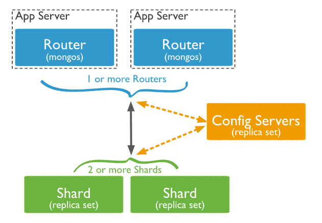

- [1. 组成](#1-组成)
  - [1.1. Mongos: Query Router](#11-mongos-query-router)
  - [1.2. Config Server](#12-config-server)
  - [1.3. Shard](#13-shard)
- [2. Shard keys](#2-shard-keys)
  - [2.1. Index](#21-index)
  - [2.2. since 4.4](#22-since-44)
  - [2.3. since 4.2](#23-since-42)
  - [2.4. prior to 4.0](#24-prior-to-40)
  - [2.5. Chunks](#25-chunks)
- [Shard key 策略](#shard-key-策略)
- [Shard 策略](#shard-策略)
  - [Hashed Shard](#hashed-shard)
  - [Ranged Shard](#ranged-shard)
  - [Zones](#zones)
- [初次分片](#初次分片)
- [分布式事务](#分布式事务)
- [其他限制](#其他限制)

# 1. 组成

## 1.1. Mongos: Query Router
转发查询请求到不同的 Shard 上

4.4 支持 Hedged Reads

## 1.2. Config Server
包含集群配置信息

## 1.3. Shard
包含被分片的数据子集，即分片

# 2. Shard keys
由一个或多个 Field 组成。

## 2.1. Index
集合必须要有一个前缀匹配 Shard key 的 Index 才能进行分片。

在空集合中，如果没有必要的 Index ，集合会自动创建一个以 Shard key 为名的 Index

## 2.2. since 4.4
refineCollectionShardKey

## 2.3. since 4.2
可以更改 Shard key 的值
无法更改 Shard key

## 2.4. prior to 4.0
无法更改 Shard key 或者 值

## 2.5. Chunks
根据 Shard key 的顺序， Cluster Balancer 会将数据平均分割成一个个小的 Chunk ，并迁移到不同的 Shard 上。

当 Chunk 的数据量过大时， MongoDB 会将这些过大的 Chunk 分成新的较小的 Chunk。

这么做会导致不同 Shard 上的 Chunk 数量不同。

那就会触发 Cluster Balancer 迁移新的 Chunk 到新的 Shard 上，最终保证不同的 Shard 拥有相近数量的 Chunk 。

这个过程也可以手动进行，在 Bulk inserts 时较为有用。

如果过大的 Chunk 只包含一个 Shard key value ，则不能被分割，成为 Jumbo Chunk ，将成为性能瓶颈。使用 4.4 提供的 refineCollectionShardKey 可以优化 Shard key ，使其可以被分割。

# Shard key 策略
从两方面考虑：
* 查询时命中尽可能少的分片
* 写入时能随机地写入每一个分片

取尽量平均分布的 value 。

单调递增或递减的 value 会导致 Chunk 过于集中于某一个 Shard ，造成性能瓶颈。

这类 key 可以采用 Hashed Shard 策略来获取更平均的分布。

更新 Shard key 时必须保证操作是幂等的。

# Shard 策略
## Hashed Shard
更平均的分配策略，但 Shard key value 不连续。

对它使用范围查询会导致全 Shard 扫描。

## Ranged Shard
默认的分片策略。

在以下 Shard key 特征下更有效率：
* 基数大
* 重复频率低
* 新值非单调递增或递减

## Zones
按照区域进行分片

# 初次分片
初次 Shard 时，集合大小受到限制，过大将无法成功分片。
```
chunkSize = 配置中设定的最大 Chunk 大小
maxSplits = 16 MB / Shard key value 的平均大小
maxCollectionSize = maxSplits * chunkSize / 2
```
列举如下：
| Shard key value 的平均大小       | 512 bytes | 256 bytes | 128 bytes | 64 bytes |
| ------------------------------- | --------- | --------- | --------- | -------- |
| 最大切分数                       | 32,768    | 65,536    | 131,072   | 262,144  |
| 最大集合大小 (64 MB Chunk Size)  | 1 TB | 2 TB     | 4 TB      | 8 TB     |
| 最大集合大小 (128 MB Chunk Size) | 2 TB | 4 TB    | 8 TB      | 16 TB    |
| 最大集合大小 (256 MB Chunk Size) | 4 TB | 8 TB    | 16 TB     | 32 TB    |

修改 chunkSize 可以提高最大集合大小的门槛。

# 分布式事务

# 其他限制
如果查询时没有指定 Shard key 或者其前缀， `mongos` 会执行广播操作，遍历所有 Shard ，大大降低查询性能。

Shard 集合和非 Shard 集合可以共存，非 Shard 集合保存在主 Shard 上。

Shard 集合无法自动转回非 Shard 集合。
