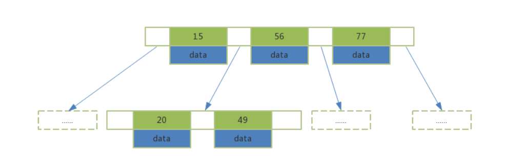

- [1. 定义](#1-定义)
- [2. 关键词](#2-关键词)
- [3. 创建](#3-创建)
- [4. 索引原理](#4-索引原理)
  - [4.1. 二分法](#41-二分法)
  - [4.2. Hash](#42-hash)
  - [4.3. B+Tree](#43-btree)
  - [4.4. 聚簇索引和非聚簇索引](#44-聚簇索引和非聚簇索引)
  - [4.5. 回表查询和覆盖索引 Covering Index](#45-回表查询和覆盖索引-covering-index)
  - [4.6. 最左前缀原则](#46-最左前缀原则)
  - [Like 查询](#like-查询)
  - [Null值](#null值)
  - [排序](#排序)
- [5. 查询分析](#5-查询分析)
  - [5.1. select_type](#51-select_type)
  - [5.2. table](#52-table)
  - [5.3. partitions](#53-partitions)
  - [5.4. type](#54-type)
  - [5.5. possible_keys](#55-possible_keys)
  - [5.6. key](#56-key)
  - [5.7. key_len](#57-key_len)
  - [5.8. ref](#58-ref)
  - [5.9. rows](#59-rows)
  - [5.10. filtered](#510-filtered)
  - [5.11. extra](#511-extra)
- [查询优化](#查询优化)
  - [慢查询](#慢查询)
  - [分页查询](#分页查询)

# 1. 定义
索引是存储引擎用于快速查找记录的一种数据结构。

需要额外开辟空间存储、需要维护数据。

在数据文件中（ InnoDB 的 ibd 文件），利用数据页存储。

索引可以加快查找速度，但降低增删改速度。

# 2. 关键词
| 分类方式 | 种类 |
| ------- | --- |
| 存储结构 | B-Tree ， Hash ， FullText? ， R Tree |
| 应用层次 | 普通索引、唯一索引（）、主键索引、复合索引（ Composite Index ） |
| 键值类型 | 主键索引（ Primary Index ）、辅助索引（二级索引 / Secondary Index ） |
| 数据和索引存储关系 | 聚簇索引（ Clustered Index ）、非聚簇索引（ Non-Clustered Index ） |

不同应用层次的索引类型可以根据需要采用不同的存储结构

# 3. 创建
```sql
CREATE [UNIQUE|FULLTEXT|SPATIAL] INDEX index_name
USING [BTREE | HASH | RTREE]
ON table_name (column_name [(length)] [ASC | DESC],…)
```

# 4. 索引原理
二分法、 Hash 和 B+Tree 等

## 4.1. 二分法
二分法需要保证索引始终有序，在增删改时成本较高，查询效率也不是很高。

## 4.2. Hash
对于 B+Tree 结构的索引，MySQL 默认？会对等值查询生成自适应 Hash 索引（内存结构，非传统意义上的索引），加快查询速度。

Hash 索引在查询等值数据时效率比 B+Tree 高，但面对范围查询时， MySQL 会使用定义的索引类型，即 B+Tree 。

除此之外还有 Hash Collision 的问题。

## 4.3. B+Tree
在二分法基础上，将新增值作为子节点挂靠在已有索引值下，并保证子节点的范围不超过父节点和它兄弟节点的范围。


B-Tree 包含 root, internal nodes 和 leaf nodes 。

B-Tree 将数据和节点保存在一起，每个内部节点和叶子节点都有各自的 key 和数据指针。


B+Tree 包含 root, internal nodes 和 leaf nodes 。

B+Tree 所有内部节点都会通过指针出现在叶子节点上，即叶子节点所在的层包含全部节点，每个叶子节点都会有一个指向下一个叶子节点的指针。

所有非叶子节点不保存数据指针，叶子节点保存数据指针。

M 阶 B+Tree 代表每个节点最多有 M 个子节点。

这样的结构使得节点区间的磁盘空间大大缩小，减少了磁盘扫描的范围，加快了扫描索引的速度？

MyISAM 中索引和数据分离，所以它的 B+Tree 的数据区域存放的是物理地址。

InnoDB 中索引和数据不分离，且数据区域存放的是行记录。

## 4.4. 聚簇索引和非聚簇索引
MyISAM 表的索引都是非聚簇索引。

InnoDB 表必须有且只有一个聚簇索引：
1. 如果有主键索引，主键索引就是聚簇索引。
2. 如果没有主键索引，第一个非空唯一索引将成为聚簇索引。
3. 如果没有非空唯一索引，自主新建隐藏 row-id 作为聚簇索引。

聚簇索引的查询速度非常快。

其他索引都是非聚簇索引，它们的数据区域存放的是指向聚簇索引的指针，如果是主键索引的话，即主键 ID 。

在 InnoDB 中，非聚簇索引也可成为辅助索引（二级索引 / Secondary Index ）

## 4.5. 回表查询和覆盖索引 Covering Index
在 InnoDB 中，当辅助索引能够满足查询结果时，可以立即返回结果，这种查询就是覆盖索引。

如果辅助索引无法满足查询结果，需要再扫描主键索引获取行记录，这个过程成为回表索引。

这里的满足结果指的是：
1. 索引涵盖了查询所需的全部行
2. 索引树（ B+Tree ）中数据区域保存的列数据就是查询 Select 中需要的字段（这里的数据默认包含了主键字段）

## 4.6. 最左前缀原则
假设字段 a,b,c ，有索引 a_b ，根据查询条件使用组合索引，有以下成功或失败案例：
| where               | 索引 | 解释 |
| ------------------- | --  | --- |
| where a             | a_b | |
| where b             |     | |
| where a and b       | a_b | |
| where b and a       | a_b | MySQL 自主优化，调整了 where 中的顺序，以匹配组合索引 a_b |
| where a and c       |     | 无索引可用 |
| where b and c       |     | 无索引可用 |
| where a and b and c | a_b | 按顺序匹配索引 a_b |
| where a and c and b | a_b | ？ |
| where c and a and b |     | ？ |

## Like 查询
前缀匹配查询时才能使用索引进行过滤。

## Null值
MySQL 的 Null 意味着一个未知值：
1. 无法使用 =, <, >
2. 运算结果始终是 Null
3. Count 不统计 Null 行
4. Null 比空字符串多一个字节

## 排序
MySQL 支持 filesort 和索引两种方式排序。

filesort 有两种排序算法：基于磁盘的双路排序和基于内存的单路排序。

假设字段 a,b,c ，有索引 a_b ，根据查询条件和排序使用组合索引，有以下成功或失败案例：
| where order                 | 索引 | 解释 |
| --------------------------- | --  | --- |
| where a order by b          | a_b | |
| where b order by a          |     | |
| where a order by c          |     | |
| where b order by c          |     | |
| where a order b, c          | a_b | ？ |
| where a order b asc, c desc | a_b | ？ |

# 5. 查询分析
```sql
EXPLAIN SELECT * from user WHERE id < 3;
```
## 5.1. select_type
* SIMPLE: 查询不包含 Union 或子查询
* PRIMARY：此查询是最外层的查询
* UNION：此查询是 Union 的第二或后续查询
* DEPENDENT UNION：Union 中第二或后续的查询语句，并使用了外面的查询结果
* UNION RESULT：Union 结果
* SUBQUERY：子查询
* DEPENDENT SUBQUERY：依赖外层查询的子查询

## 5.2. table
被查询表名称

## 5.3. partitions
分区信息

## 5.4. type
表示存储引擎查询数据时采用的方式。据此可判断是否是全表扫描或部分扫描。常用属性按效率递增排列如下：
* all：全表扫描
* index：扫描索引
* range：范围查询索引
* ref：使用非唯一索引做单值查询
* eq_ref：在 join 查询中一对一匹配关联表的查询
* const：使用主键或唯一索引做等值查询
* NULL：不访问表的查询，如调用方法，缓存？

## 5.5. possible_keys
查询可能用得着的索引名称

## 5.6. key
查询时用到的索引名称

## 5.7. key_len
查询使用到索引的字节数量。用来判断使用索引的数量。

key_len = 索引字段字节数量 + 索引字段属性

索引字段字节数量 = {
    字符串类型：{
        char(n)： n * 字符集长度
        varchar(n)： n * 字符集长度 + 2
    }
    数值类型：{
        TINYINT: 1
        SMALLINT：2
        MEDIUMINT：3
        INT/FLOAT：4
        BIGINT/DOUBLE：8
    }
    时间类型：{
        DATE：3
        TIMESTAMP：4
        DATETIME：8
    }
}

索引字段属性 = NOT NULL ？ 0 ： 1

## 5.8. ref
？？？

## 5.9. rows
查询需要扫描的预估行数

## 5.10. filtered
查询命中的实际百分比

## 5.11. extra
* Using where：需要回表查询？
* Using index：索引结果即可满足
* Using index condition：使用索引进行过滤
* Using filesort：查询结果需要额外排序，较大则涉及磁盘
* Using temporary：去重、分组时用到了临时表

# 查询优化
## 慢查询

## 分页查询
