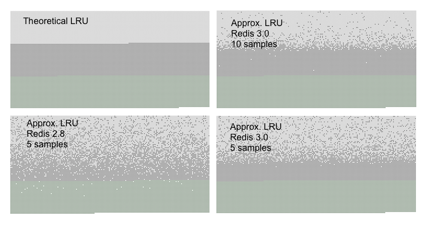

# Invalidation strategy
## 定时删除
通过定时器删除

## 惰性删除
设置 expire 后，重新访问 key 时，判断是否 expired ，在根据结果进行删除

## 主动删除
通过 redis.conf 中 maxmemory-policy 的策略配置
| policy           | description |
| ---------------- | ----------- |
| no-enviction     | 默认，不删除 |
| allkeys-lru      | 在数据集中使用 approximated LRU algorithm 选取，并淘汰其中 redisObject.lru 最大的键值 |
| allkeys-lfu      | 在数据集中使用 approximated LRU algorithm 选取，并进行 lfu 淘汰 |
| volatile-lru     | 从过期时间的表中随机挑选几个键值对，进行 lru 淘汰 |
| volatile-lfu     | 从过期时间的表中随机挑选几个键值对，进行 lfu 淘汰 |
| volatile-random  | 从过期时间的表中随机挑选几个键值对，进行随机淘汰 |
| volatile-ttl     | 从过期时间的表中随机挑选几个键值对，取出其中 ttl 最小的键值对淘汰 |

approximated LRU algorithm(sampling, default 5)

# 缓存问题
## Cache Penetration 缓存穿透
## Cache Hotspot 缓存击穿、热点缓存失效
## Cache Avalanches 缓存雪崩
## Cache Breakdown 缓存宕机
## BigKey
## Update strategy
