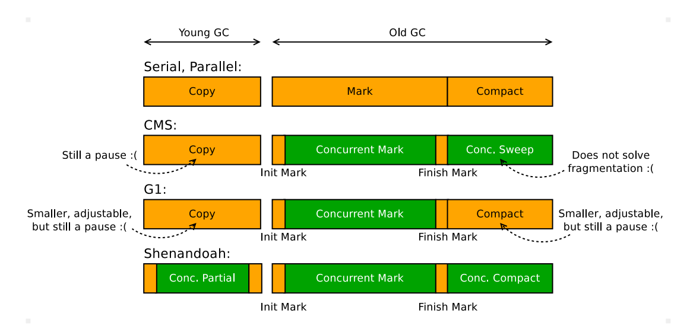
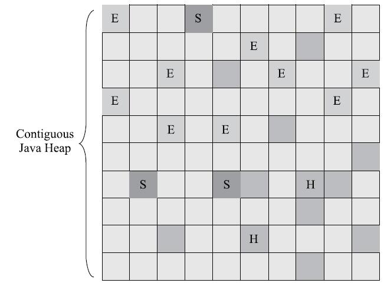
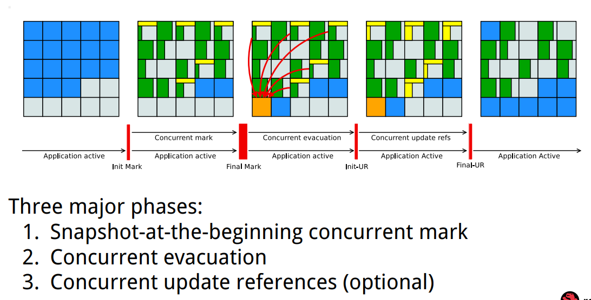

# GC optimization objectives
1. throughput
1. latency
1. memory footprint

# GC choices
1. Serial
1. Serial Old
1. Parallel Old
1. ParNew
1. Parallel Scavenge
1. CMS
1. ZGC
1. Epsilon

## General GC progress


## G1

## Shenandoah
https://shipilev.net/talks/devoxx-Nov2017-shenandoah.pdf


# GC logs
| pre JDK 9                              | post JDK 9                        | desc |
| -------------------------------------- | --------------------------------- | ---- |
| -XX:+PrintGC(-verbose:gc)              | -Xlog:gc                          | 输出简要GC日志 |
| -XX:+PrintGCDetails                    | -Xlog:gc*=<verbose>               | 输出详细GC日志 |
| -Xloggc:gc.log                         | -Xlog:gc*:file=<gc-log-file-path> | 输出GC日志到文件 |
| -XX:+PrintGCTimeStamps                 | -Xlog:gc*                         | 输出GC的时间戳（以JVM启动到当期的总时长的时间戳形式） |
| -XX:+PrintGCDateStamps                 | -Xlog:gc*::time,level,tags        | 输出GC的时间戳（以日期的形式，如 2013-05-04T21:53:59.234+0800） |
| -XX:+PrintHeapAtGC                     | -Xlog:gc+heap=debug               | 在进行GC的前后打印出堆的信息 |
| -XX:+PrintReferenceGC                  | -Xlog:gc+ref=debug                | 打印年轻代各个引用的数量以及时长 |
| -XX:+PrintGCApplicationConcurrentTime  | -Xlog:safepoint                   | 查看 GC 过程中用户线程并发时间 |
| -XX:+PrintGCApplicationStoppedTime     | -Xlog:safepoint                   | 查看 GC 过程中用户线程停顿的时间 |
| -XX:+PrintAdaptiveSizePolicy           | -Xlog:gc+ergo*=trace              | 查看收集器 Ergonomics 机制 |
| -XX:+PrintTenuringDistribution         | -Xlog:gc+age=trace                | 查看熬过收集后剩余对象的年龄分布信息 |

post JDK 9 general format
```
-Xlog[:[selector][:[output][:[decorators][:output-options]]]]
examples:
-Xlog:gc*=info::uptime,level,tags
```
## selectors
add， age， alloc， annotation， aot， arguments， attach， barrier， biasedlocking， blocks， bot， breakpoint， bytecode， census， class， classhisto， cleanup， compaction， comparator， constraints， constantpool， coops， cpu， cset， data， defaultmethods， dump， ergo， event， exceptions， exit， fingerprint， freelist， gc， hashtables， heap， humongous， ihop， iklass， init， itables， jfr， jni， jvmti， liveness， load， loader， logging， mark， marking， metadata， metaspace， method， mmu， modules， monitorinflation， monitormismatch， nmethod， normalize， objecttagging， obsolete， oopmap， os， pagesize， parser， patch， path， phases， plab， preorder， promotion， protectiondomain， purge， redefine， ref， refine， region， remset， resolve， safepoint， scavenge， scrub， setting， stackmap， stacktrace， stackwalk， start， startuptime， state， stats， stringdedup， stringtable， subclass， survivor， sweep， system， task， thread， time， timer， tlab， unload， update， verification， verify， vmoperation， vtables， workgang

## output
file output

## decorators
* time
* timemills
* uptime
* uptimemills
* pid
* tid
* level
* tags

# GC parameters
## GC types
* UseSerialGC
* UseParNewGC: ParNew + Serial Old
* UseConcMarkSweepGC: ParNew + CMS + Serial Old
* UseParallelGC: Parallel Scavenge + Serial Old
* UseParallelOldGC: Parallel Scavenge + Parallel Old
* UseG1GC
* UseShenandoahGC
* UseZGC

## General
* ConcGCThreads

## Generational
* SurvivorRatio
* PretenureSizeThreshold
* MaxTenuringThreshold: age
* UseAdaptiveSizePolicy
* HandlePromotionFailure
* ParallelGCThreads

## Parallel Scavenge
* GCTimeRatio
* MaxGCPauseMillis
* useNUMA

## CMS
* CMSInitiatingOccupancyFraction
* UseCMSCompactAtFullCollection
* CMSFullGCsBeforeCompaction

## G1
* G1HeapRegionSize
* MaxGCPauseMillis
* G1NewSizePercent
* G1MaxNewSizePercent
* InitiatingHeapOccupancyPercent

## Shenandoah
* ShenandoahGCHeuristics: adaptive, static, compact, passive, aggressive

## ZGC
(combine with -XX:+UnlockExperimentalVMOptions)
* useNUMA
