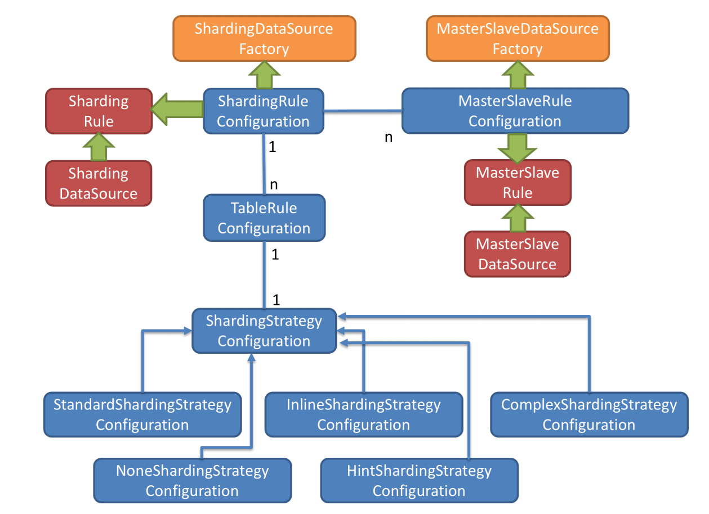

# sharding-jdbc-spring-boot-starter
```java
SpringBootConfiguration
    + SpringBootShardingRuleConfigurationProperties
    + SpringBootMasterSlaveRuleConfigurationProperties
    + SpringBootEncryptRuleConfigurationProperties
    + SpringBootPropertiesConfigurationProperties
    + SpringBootShadowRuleConfigurationProperties
    DataSource shardingDataSource
    DataSource masterSlaveDataSource
    DataSource encryptDataSource
    DataSource shadowDataSource
    ShardingTransactionTypeScanner shardingTransactionTypeScanner
```

# ConfigurationProperties
```java
YamlShardingRuleConfiguration
    // prefix = "spring.shardingsphere.sharding"
    SpringBootShardingRuleConfigurationProperties
        + String defaultDataSourceName
        + YamlShardingStrategyConfiguration defaultDatabaseStrategy
            + YamlStandardShardingStrategyConfiguration standard
            + YamlComplexShardingStrategyConfiguration complex
            + YamlHintShardingStrategyConfiguration hint
            + YamlInlineShardingStrategyConfiguration inline
            + YamlNoneShardingStrategyConfiguration none
        + YamlShardingStrategyConfiguration defaultTableStrategy
        + YamlKeyGeneratorConfiguration defaultKeyGenerator
            + String type
            + String column
            + Properties props
        + YamlEncryptRuleConfiguration encryptRule
        + Collection<String> bindingTables
        + Collection<String> broadcastTables
        + Map<String, YamlTableRuleConfiguration> tables
            + String logicTable
            + String actualDataNodes
            + YamlShardingStrategyConfiguration databaseStrategy
            + YamlShardingStrategyConfiguration tableStrategy
            + YamlKeyGeneratorConfiguration keyGenerator
        + Map<String, YamlMasterSlaveRuleConfiguration> masterSlaveRules
YamlMasterSlaveRuleConfiguration
    // prefix = "spring.shardingsphere.masterslave"
    SpringBootMasterSlaveRuleConfigurationProperties
        + String name
        + String masterDataSourceName
        + List<String> slaveDataSourceNames
        + String loadBalanceAlgorithmType
        + Properties props
YamlEncryptRuleConfiguration
    // prefix = "spring.shardingsphere.encrypt"
    SpringBootEncryptRuleConfigurationProperties
        + Map<String, YamlEncryptorRuleConfiguration> encryptors
            + String type
            + Properties props
        + Map<String, YamlEncryptTableRuleConfiguration> tables
            + Map<String, YamlEncryptColumnRuleConfiguration> columns
                + String plainColumn
                + String cipherColumn
                + String assistedQueryColumn
                + String encryptor
// prefix = "spring.shardingsphere.shadow"
SpringBootShadowRuleConfigurationProperties
    + String column
    + YamlMasterSlaveRuleConfiguration masterSlaveRule
    + YamlEncryptRuleConfiguration encryptRule
    + YamlShardingRuleConfiguration shardingRule
    + Map<String, String> shadowMappings
SpringBootPropertiesConfigurationProperties
```
